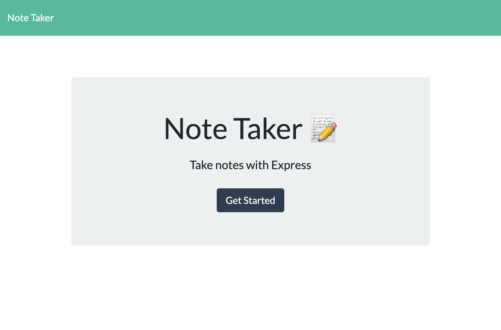
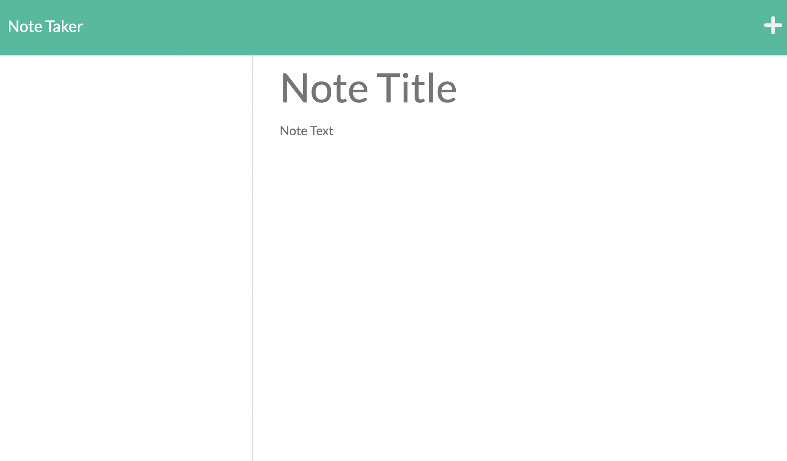

# Note-Taker-HW

Application is deployed links:

Heroku: https://agile-woodland-92654.herokuapp.com/
Github: https://adrianauch.github.io/Note-Taker-HW/

## Description:

The application was created for users to to enter in notes and save them. The appilication opens with a homepage where the user is directed to the next screen where they are able to create a note with a title and and description. The user is then able to sove the note and it will appear on the left side for them to reference later. They are also able to delete a note once it is completed. The application uses express module, and api routing to save notes.

## Installation

In order to use the application please download the node modules with npm i.

## Usage

1. Ensure that the local host is listening by running node server.js
2. Go to the local host address localhost:3001
3. click the button start notes
4. type in note (the user will need to enter both a title and text to save the note)
5. save the note
6. click on the notes on the left hand side or the plus sign to add another note.

## Credits:

The application is coding in javascript but uses express.js and node.js.

## Lisence:

MIT License

Copyright (c) 2021 AdrianAuch

Permission is hereby granted, free of charge, to any person obtaining a copy
of this software and associated documentation files (the "Software"), to deal
in the Software without restriction, including without limitation the rights
to use, copy, modify, merge, publish, distribute, sublicense, and/or sell
copies of the Software, and to permit persons to whom the Software is
furnished to do so, subject to the following conditions:

The above copyright notice and this permission notice shall be included in all
copies or substantial portions of the Software.

THE SOFTWARE IS PROVIDED "AS IS", WITHOUT WARRANTY OF ANY KIND, EXPRESS OR
IMPLIED, INCLUDING BUT NOT LIMITED TO THE WARRANTIES OF MERCHANTABILITY,
FITNESS FOR A PARTICULAR PURPOSE AND NONINFRINGEMENT. IN NO EVENT SHALL THE
AUTHORS OR COPYRIGHT HOLDERS BE LIABLE FOR ANY CLAIM, DAMAGES OR OTHER
LIABILITY, WHETHER IN AN ACTION OF CONTRACT, TORT OR OTHERWISE, ARISING FROM,
OUT OF OR IN CONNECTION WITH THE SOFTWARE OR THE USE OR OTHER DEALINGS IN THE
SOFTWARE.

## Badge

## How to contribute:

Please reach out to me via email if you have any question, sucggestions or comments. Also, you can check out me git hub - https://github.com/adrianauch.
